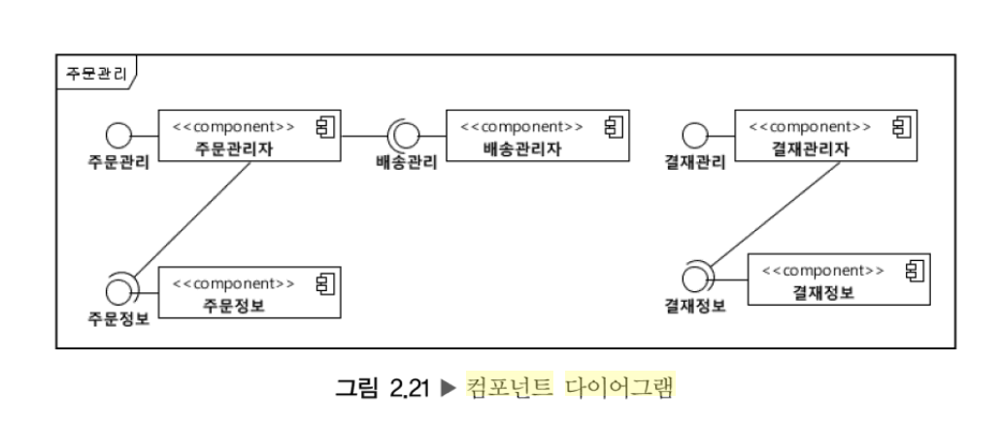
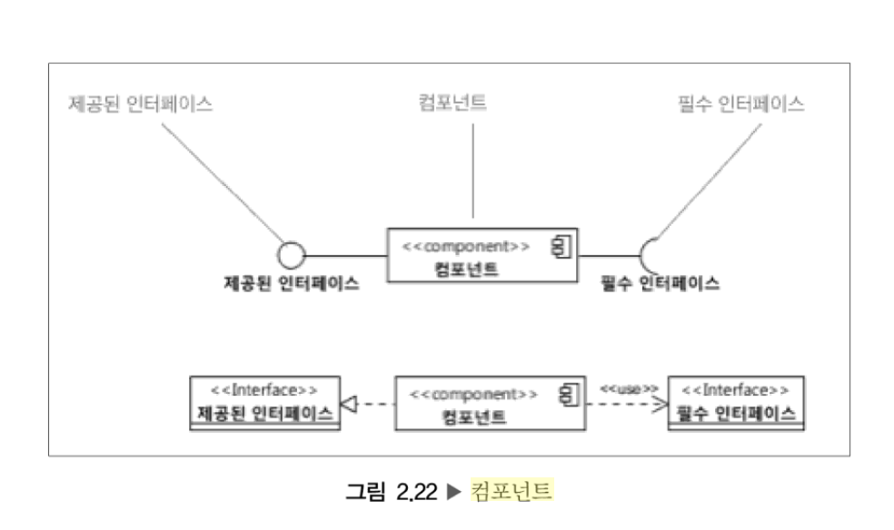

= 컴포넌트 다이어그램(Component Diagram)
:showtitle:
:page-navtitle: 컴포넌트 다이어그램(Component Diagram)
:page-excerpt: Excerpt goes here.
:page-root: ../../../

== 컴포넌트 다이어그램
컴포넌트 다이어그램(Component Diagram)은 논리적 또는 물리적인 시스템의 구조를 나타낸 것으로, 컴포넌트, 컴포넌트 인터페이스 그리고 컴포넌트 사이의 관계로 표현된다. 이는 논리뷰(logical view) 혹은 물리뷰(physical view)를 표현하는 데 사용하기도 한다.footnote:component-diagram[UML 분석 설계 실무, 전병선, 2014, 54p]

== 컴포넌트
컴포넌트(component)는 캡슐화되어 있으며 재사용할 수 있고 대체할 수 있는 소프트웨어 모듈을 표현하는 모델 요소이다. 컴포넌트는 제공된 인터페이스(provided interface)를 구현하여 외부에 서비스를 제공하며, 필수 인터페이스(required interface)를 사용하여 다른 컴포넌트의 기능을 활용함으로써 내부 기능을 구현한다.footnote:component[UML 분석 설계 실무, 전병선, 2014, 55p]

== 컴포넌트 다이어그램을 PlantUML로 그리기

[plantuml, svg]
....
package "Some Group" {
  HTTP - [First Component]
  [Another Component]
}

node "Other Groups" {
  FTP - [Second Component]
  [First Component] --> FTP
}

cloud {
  [Example 1]
}

database "MySql" {
  folder "This is my folder" {
    [Folder 3]
  }
  frame "Foo" {
    [Frame 4]
  }
}

[Another Component] --> [Example 1]
[Example 1] --> [Folder 3]
[Folder 3] --> [Frame 4]
....

